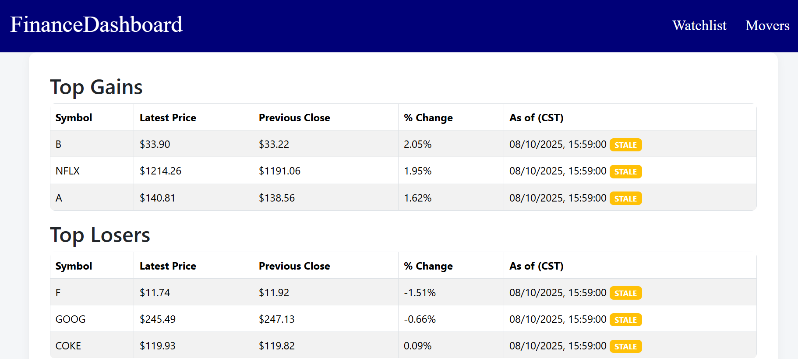
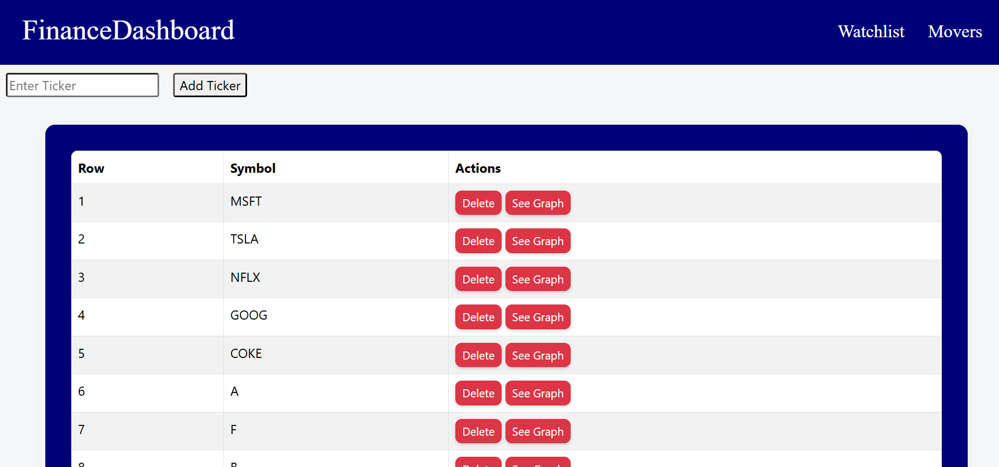
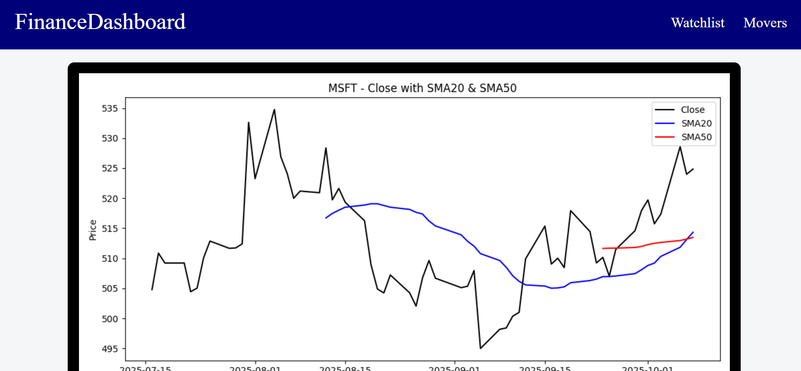

# stocks-dashboard
- Dashboard to add stocks to monitor daily performance using real-time market data from yfinance.

#Why I built it
- I wanted to create something that helped cement my experience in designing a full web application. My previous project focused on a single feature, so this time I set out to build a complete user experience — from the backend services to the frontend interface.

#Tech Stack
Backend: Flask, SQLAlchemy, Alembic, APScheduler
Database: PostgreSQL (via psycopg2)
Data: yfinance, pandas, numpy
Caching: cachetools, Redis
Visualization: Matplotlib, Plotly
Testing: pytest
Other Tools: python-dotenv for environment configuration

#Features
- Add and remove stock symbols from personal watchlist.
- Fetch prices using yfinance api and caches them for efficiency.
- Views top and bottom movers of current watchlist (highlights if they are using old data).
- View graph of specific stocks highlighting historical data of SMA20 and SMA50.
- Schedules updates of stocks.

##Additional things to add in future
- Search bar for watchlist.
- Additional information such as industry and allow filtering.
- Have # of movers be editable as only the top 3 movers are shown for the respective category.

#Setup and installation
Development with Docker

This project uses a VS Code Dev Container to provide a consistent Python 3.11 development environment.
It ensures that the application runs in the same configuration on any machine with Docker and VS Code installed.

#Development with Docker

- This project includes a VS Code Dev Container for a consistent Python 3.11 environment.
- Make sure you have Docker Desktop, Visual Studio Code, and the Dev Containers extension installed.
- Open the project in VS Code and choose “Reopen in Container.”
- The container will build automatically and install dependencies from requirements.txt.
- Once inside the container, run flask run to start the app on http://localhost:5000.
- Tests can be run with pytest -v.

##Screenshots
###Watchlist Main Page

###Movers Page

###Chart rendered for stocks

